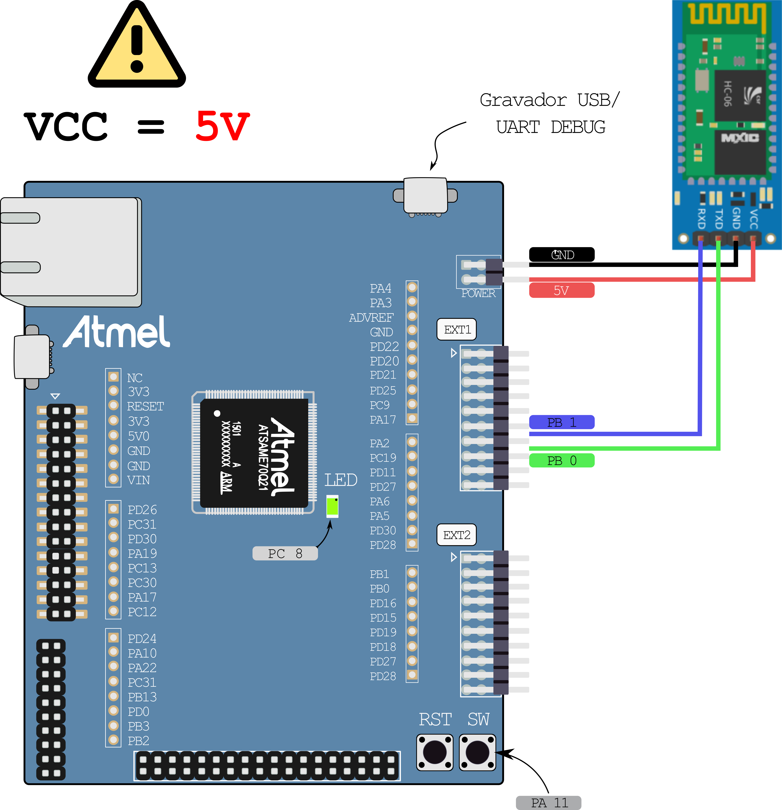
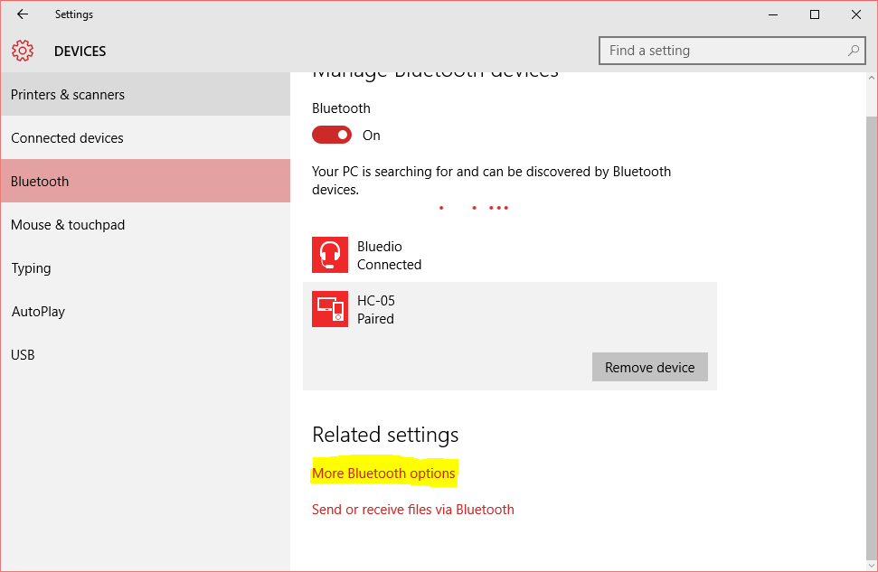

HC-05_ATCommandSet -> https://s3-sa-east-1.amazonaws.com/robocore-lojavirtual/709/HC-05_ATCommandSet.pdf
HC-06_ATCommandSet -> https://mcuoneclipse.com/2013/06/19/using-the-hc-06-bluetooth-module/

# Bluetooth HC-05

Exemplo de como usar o bluetooth HC-05 com o kit de desenvolvimento
SAME70-XPLD.

O [HC-05](https://www.itead.cc/wiki/Serial_Port_Bluetooth_Module_(Master/Slave)_:_HC-05)
é um módulo bluetooth popular (R$15) que pode funcionar como
device ou host, neste exemplo usaremos como device (conectando-se ao
computador). O Computador (windows) verá o módulo HC-05 como um dispositivo
bluetooth, e uma vez pareado e conectado o Windows irá criar uma porta
COM (serial) associado a conexão, nessa porta faremos a recepção e 
envio dos dados via bluetooth.

O modulo será conectado ao microcontrolador através de uma comunicação
UART (a mesma que vocês implementaram em camada física), o microcontrolador
pode enviar dados para o computador por esta porta (TX) ou receber
dados do computador (RX), conforme diagrama a seguir:

``` 
    +----------+            +-------+             +----------+
    |    +-----|            |       |   <---->    |    +-----|
    |    |USART| ----tx---> |       |             |    | COM <---> python
    |    +-----| <---rx---- |       |  BLUETOOTH  |    +-----|
    | uc       |            | HC-05 |             | PC       |
    +----------+            +-------+             +----------+
```

No microcontrolador iremos usar um periférico chamado de USART para
realizar a serialização e desserialização do dado no protocolo UART.
A comunicação com o módulo HC-05 segue um protocolo chamado de 
[**AT Command**](https://www.itead.cc/wiki/Serial_Port_Bluetooth_Module_(Master/Slave)_:_HC-05).

Já no computador iremos usar um programa em python que acessará 
a porta COM criada pelo windows para enviar e receber dados do
microcontrolador via protocolo bluetooth.

Note que estamos lidando com o bluetooth de forma "transparente",
apenas como "usuários", toda a mágica acontece dentro do HC-05.

## Exemplo

Esse exemplo é composto de duas partes:

- **/firmware**: Código C para executar no microcontrolador
- **/python**: Código python para executar no computador

O firmware pode operar de duas maneira: conectado ao bluetooth ou não. 
Isso é definido no firmware descomentando o define: 

```c
#define DEBUG_SERIAL
```

Já o exemplo em `python` é para ser executado no computador, e temos
dois exemplos disponíveis: 

1. `game_controller` : emula um teclado
1. `youtube_controller` : emula um joystick 

## Conectando

**ATENÇÃO -> VCC = 5V**



### firmware

Abra o projeto `firmware` no MicrochipStudio. Antes lembre de conectar o bluetooth como indicado anteriormente.

Vamos modificar o firmware alterando o nome e a senha do bluetooth. 
Para isso será necessário alterar a função `hc05_init` nos comandos de configuração
que configuram o nome e a senha do device: `AT+NAME` e `AT+PIN`.

O exemplo configura o bluetooth com o nome `MarcoMello` e senha `0000`:

- `AT+NAMEMarcoMello`
- `AT+PIN0000`

Para alterar o nome e a senha (4 dígitos) basta alterar:

- `AT+NAMExxxxxxxx`
- `AT+PINyyyy`

Tudo isso na função `hc05_init`:

```c
int hc05_init(void) {
    // ....
	usart_send_command(USART0, buffer_rx, 1000, "AT+NAMEMarcoMello", 1000); 
    // ....
	usart_send_command(USART0, buffer_rx, 1000, "AT+PIN0000", 1000);
 }
```

**Compile e programe o projeto**

### Conectando ao HC-05 

Procure no Windows 10 as configurações de Bluetooth igual a imagem abaixo. Realize o pareamento com o HC05 do seu grupo. Em seguida, clique em "Mais configurações de Bluetooth" conforme marcado em amarelo.   



Procure por "Portas COM" e clique em adicionar:


Selecione como porta de saída e o HC05 do seu grupo. E o serviço Dev B.:


Verifique se placa conecta com o computador na porta COM configurada anteriormente, isto pode ser verificado utilizando o software [PuTTy](https://www.putty.org), conecte na COM configurada. Se estiver conectado e funcionando você deverá ver vários (`X0` ou `X1` dependendo se o botão da placa está apertado ou não).

## Exemplos python

Disponibilizamos dois exemplos de programas python que devem ser escolhidos de acordo com o que seu controle irá controlar: Se for um programa no computador você deve usar o exemplo `youtube_controller.py` e se for um jogo o exemplo `game_controller.py`.

O exemplo do programa emula um teclado no computador, e uma ação do controle vira uma ação nesse teclado virtual. Exemplo: Se você quer parar um vídeo no youtube basta apertar a tecla `espaço`. O que esse exemplo faz é receber um comando pela UART/Bluetooth e emular que a tecla espaço foi pressionada.

Já o exemplo do jogo é diferente pois ele não emula um teclado e sim um joystick, tivemos que fazer isso pois muitos jogos não funcionam com teclado e a latência do teclado era muito grande, impossibilitando o uso do controle para alguns jogos.

Os exemplos estão nas pastas listadas a seguir, e cada um possui um README que deve ser seguido para fazerem funcionar pela primeira vez.

- python-pyautogui
- python-vjoy

## OLED + Bluetooth?

A pasta `RTOS-OLED-Xplained-Pro-Bluetooth` possui um exemplo de como usar o OLED com o bluetooth, para isso conecte a OLED no EXT1 e o bluetooth em novos pinos do EXT2:

- TX do bluetooth no pino PA21
- RX do bluetooth no pino PB4

> Atenção:
>
> 1. estamos usando os mesmos pinos da UART que são usados no printf.
> 1. Alteramos o baudrate do terminal para 9600, devido a taxa de comunicação com o módulo HC05


